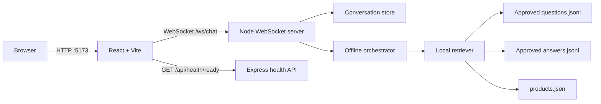

# Simplified Offline Architecture

## Runtime overview



There are no runtime calls to Bedrock, embedding APIs, databases, or external document services. Product links are displayed to users but are not fetched by the backend.

## Request flow

1. The browser opens a WebSocket connection to `/ws/chat`.
2. Vite proxies that connection to the backend on `127.0.0.1:3000` during development.
3. The backend validates the protocol event and enforces message/session limits.
4. Conversational messages such as greetings are handled deterministically.
5. Product questions pass to the local retriever.
6. The retriever checks, in order:
   - normalized exact question match;
   - exact FGMN or product-name entity match;
   - recent-product context for follow-up wording;
   - lexical/fuzzy question search;
   - lexical product search;
   - safe no-match response.
7. The backend returns answer text, product cards, and approved source links through protocol-v2 WebSocket events.

## Data model

```text
artifacts/
├── current.json
└── releases/20260915T193824969Z-345d2fae/
    ├── manifest.json
    ├── report.json
    ├── products.json       # 979 products
    ├── answers.jsonl       # 879 approved answers
    └── questions.jsonl     # 6,879 approved variants
```

Embeddings, chunks, generation runs, review queues, and historical releases are intentionally omitted because the runtime never reads them.

## Components

### Frontend

- React renders the chat, progress, product cards, and sources.
- Search stages remain visible as a short status trail, and completed answer text is revealed progressively for a natural chat experience.
- Native browser WebSocket handles chat events.
- No frontend API key or cloud SDK is present.

### Backend

- Express exposes liveness/readiness endpoints.
- `ws` implements the chat protocol.
- MiniSearch provides local lexical and bounded-fuzzy matching.
- Zod validates environment, client events, answers, and questions.
- An in-memory conversation store tracks context and turn limits.

### Data

- `current.json` selects one immutable release.
- The release loader validates JSON schemas, IDs, product references, and normalized-question conflicts at startup.
- Generated answers are marked approved in the release, with POC review provenance.
- Catalog descriptions provide deterministic fallback for products without a generated answer.

## Operational boundaries

- Intended for local demonstrations, not production product guidance.
- No authentication or persistence across backend restarts.
- One backend process serves one local corpus release.
- The UI and backend must run on ports 5173 and 3000 unless their configuration is updated together.
